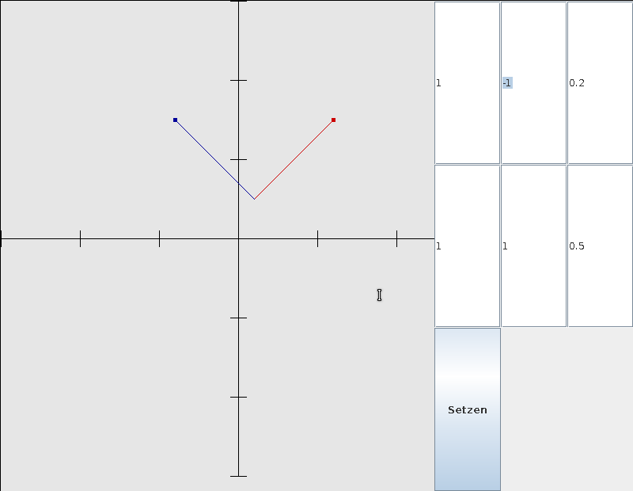

.. Copyright © 2014, 2016-2017 Martin Ueding <dev@martin-ueding.de>

#########
affinator
#########

In tenth grade, a transformation like this took a picture of the new basis
vectors to be understandable:

.. math::

    \vec x \to \vec x' =
    \begin{pmatrix}
        1 & -1 \\
        1 & 1
    \end{pmatrix}
    \vec x
    +
    \begin{pmatrix}
        0.2 \\ 0.5
    \end{pmatrix}

So I wrote a little program that does this visualization for me.

Download
========

Compiled version: `<affinator.jar>`_
